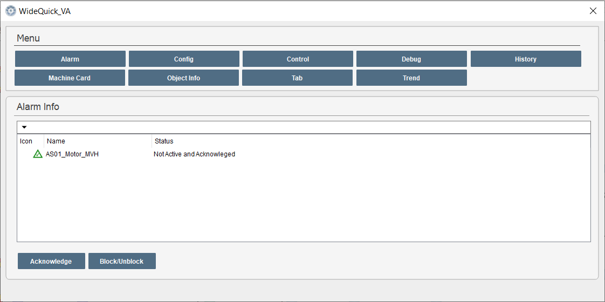
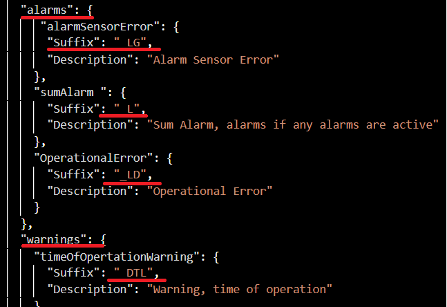
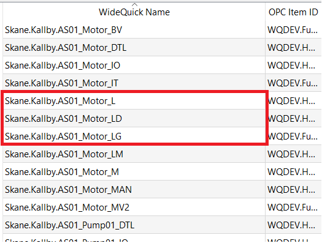

Alarms
=====
There are two different types of alarms in WideQuick VA. One of them is user defined alarms and the other is alarm tags. The difference between the two will be explained below. 

**NOTE:** For the following examples we will use: Skane.Kallby.AS01_Motor as an example.

## User defined alarms
User defined alarms are alarms that can be created by the user. To create an alarm and connect it to an object. Right click on alarms in the project tree and select "Add group". Next name the group according to the following structure:
Alarm.Connection.Device

**EXAMPLE:** Alarm.Skane.Kallby

Next create a new alarm acording to the following strucutre:
System_Object_UserDefinedName

**EXAMPLE:** AS01_Motor_MVH

BILD

The newly created alarm will then be visible in both the general alarm page(Länk?) and the [Alarm Popup](../Common_Popups/Alarm_Popup.md) for the specific object. In this case Skane.Kallby.AS01_Motor. See picture below:

<figure>
    
    <figcaption>The alarm popup page for Skane.Kallby.AS01_Pump06</figcaption>
</figure>

## Alarm tags
Alarm tags are all tags with a suffix belonging to the alarm or warning group in suffix.JSON. See exampel below. Once this tag turns high the icon for the object connected to this tag will turn yellow/red depending on if it is an alarm or a warning. Furthermore if the smart-object contains an [Alarm Status](../Smart_Objects/Support_Objects/Alarm_Status.md) the alarms status indicator will be visible.
 
**Example:**
<figure>
    
    <figcaption>Suffixes defined as Alarms and warnings in Suffix.JSON</figcaption>
</figure>

<figure>
    
    <figcaption>A collection of alarm tags (OPC)</figcaption>
</figure>

