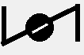

# Valves

| Symbol                             | Name                      |
| ----------------------------------: | ------------------------- |
|            | Valve                     |
|     | Globe Valve               |
|     | Rotary Valve              |
|     | Needle Valve              |
|    | Control Valve             |
|     | Piston Operated Valve     |
|  | Back Pressure Regulator   |
|       | Cock Valve                |
|      | Check Valve               |
|     | Check Valve2              |
|            | Butterfly Valve           |
|            | Flanged Valve             |
|            | Flanged Valve 2           |
|            | Angle Bowdown Valve       |
|            | Normaly Closed Ball Valve |
|            | Normaly Closed Ball Valve |
|            | Flow Meter                |
