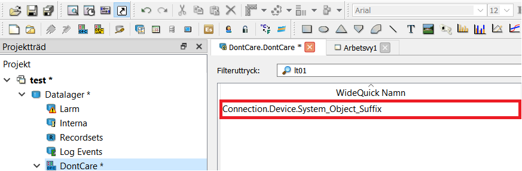

Tag Structure
=======
WideQuick VA supports both OPC and MODBUS tags.

The setup is different for OPC and MODBUS but the tagstructure is the same. Following the structure:

- Connection 
    - Device
        - System
            - Object
                - Suffix

The names of these is arbitrary and they can be named whatever the user desires. These will later be used to connect OPC tags to the different objects placed in workviews.

For these examples we will use the following information as an example.

**Connection:** Skane

**Device:** Kallby

**System:** AS01

**Object:** Pump

**Suffix:** _MV

## OPC
WideQuick VA support both OPC DA and OPC UA tags. To import tags right-click on DataStore in the project tree and select "Add OPC (UA) Server". Name the connection to whatever you want and fill in the rest of the information.

**NOTE:** The chosen name will NOT affect how the tags will be named

Next right click on the newly created server and select "Add group". Name the group whatever you want. 

**NOTE:** The chosen name will NOT affect how the tags will be named

This will bring up a new page. Click on "browse" and import all desired OPC tags. Next. Rename the tags in the colomun "WideQuick Name".
Rename all tags to follow the structure:

Connection.Device.System_Object_Suffix

Example:

Skane.Kallby.AS01_Pump_MV

## MODBUS
MODBUS tags follow the same structure as OPC tags. But due to differences in WideQuick the naming process is a bit different. First right-click on DataStore in the project tree and select "Add Modbus ... connection".

**NOTE:** The name of the connection will be later become the "Connection" part in the tagName so choose the name wisely. In our example this would be "Skane"

Next right-click on the newly created connection and select "Add Device".

**NOTE:** THe name of the device will later become the "Device" part in the tagName so choose the name wisely. In our example this would "Kallby"

This will bring up a new page. Click on "add". Name the new post according to the following structure:

System_Object_Suffix

In our example this would be:

AS01_Motor_MV

See below:

