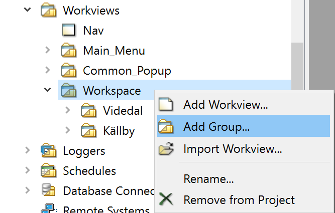
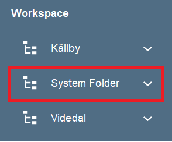
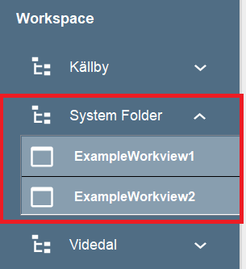

## Introduction
Creating new workviews in WideQuick VA is a very quick and easy process. Once the system and workviews have been created a link to them will be auto-generated in the navigation tree.

## Creating a workview folder
The first step in creating workviews in WideQuick VA is to create a folder where the workviews will be placed. To do this right click on the Workspace folder inside workviews. Select "Add Group" as seen below:

 Name the folder. This folder will be called the "System folder" from here on. The name of the system folder is what will be shown in the navigation tree. This is automatically generated as seen below:

## Creating a workview
Once a "System folder" has been created the next step is to create the workviews. Right click on the system folder you just created. Click "Add workview". Name the workview. WideQuick VA will now auto-generate both the system folder and all workviews and display them in the Navigation tree in runtime.

